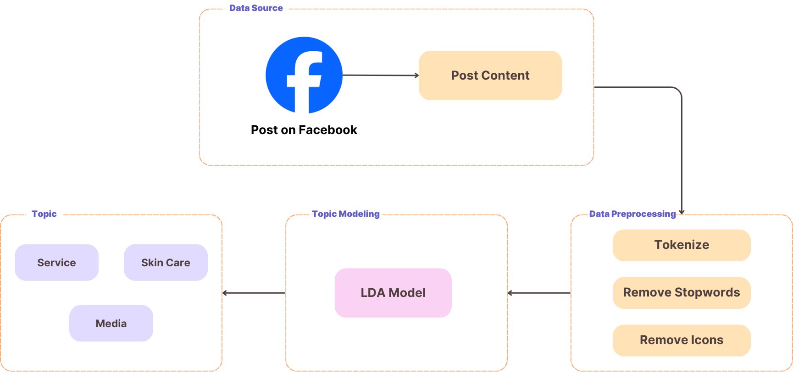
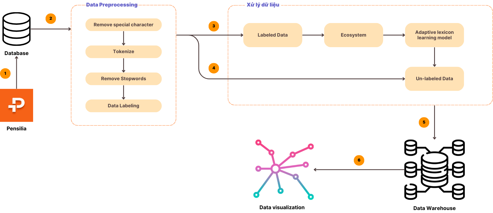

# Readme.md

## Pensilia Social Media Data Analysis Project

### Project Overview

This project focuses on analyzing social media data for Pensilia, a leading beauty clinic in Vietnam, to enhance their social media marketing strategies. The analysis aims to understand the performance of their posts, audience engagement, and overall effectiveness of their communication strategies across various social media platforms including Facebook, Instagram, TikTok, and YouTube.

### Project Structure

The project is structured into two main layers:

1. **Business Understanding Layer:**
   - **Fanpage Karma Analysis:**
     - Using Fanpage Karma to analyze the performance of Pensilia's social media pages.
     - Collecting data on engagement metrics, follower growth, and post interactions.
   - **SWOT Analysis:**
     - Identifying Pensilia's strengths, weaknesses, opportunities, and threats in the social media landscape.
   - **Five Forces Model:**
     - Analyzing the competitive environment using Porter's Five Forces model to understand the influence of competitors, new entrants, suppliers, customers, and substitute products.

2. **Proposed Solution Layer:**
   - **Post Predictive Model:**
    
     - Extracting features from post content using TF-IDF.
     - Training machine learning models like XGBoost, Random Forest, and Support Vector Machine to predict post engagement.
   - **Topic Modeling:**
    
     - Implementing Latent Dirichlet Allocation (LDA) to identify key topics discussed in the posts and comments.
   - **Sentiment Analysis:**
    
     - Using an Adaptive Lexicon Learning model to classify comments as positive, negative, or neutral.
     - Analyzing sentiment trends to gauge customer satisfaction and identify areas of improvement.

### Tools and Technologies

- **Data Collection:** Apify, Python (Requests, BeautifulSoup)
- **Data Preprocessing:** Python (Pandas, NLTK, SpaCy, underthesea)
- **EDA and Visualization:** Power BI, Matplotlib, Seaborn
- **Topic Modeling:** Gensim (LDA)
- **Sentiment Analysis:** Custom Adaptive Lexicon Learning model
- **Machine Learning:** Scikit-Learn (XGBoost, Random Forest, SVM)
- **Project Management:** Git, GitHub

### Team Members

- Trần Hoàng Anh (K214162143)
- Lê Quốc Dân An (K214162140)
- Cao Nguyễn Hải Như (K214162148)
- Trần Thị Minh Hiền (K214160989)

### Supervising Instructor

- PhD. Lê Hoành Sử

### Conclusion

This project aims to provide Pensilia with actionable insights derived from their social media data. By implementing advanced data analysis techniques such as post predictive modeling, topic modeling, and sentiment analysis, the team seeks to optimize Pensilia's social media strategies, enhancing customer engagement and satisfaction.
